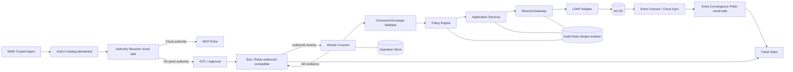

# Architecture overview — MWA AD Connector on-premises

## Scopo

Servizio on-premises Python 3.11+ (FastAPI, Pydantic v2/Settings, uv, pytest, Ruff 120, mypy strict) che espone capability LDAP AD specifiche, versionate e allowlisted, riceve comandi cloud via worker outbound-only e verifica ogni mutazione con read-after-write. Convergenza Entra solo cloud-side.

## Diagramma logico

## Flusso di autorità (cloud)

Solo il Trusted Agent accede agli MCP; l'Action Catalog impone server, rischio, idempotenza, rollback e campi sensibili. `AuthorityResolver` deterministico e configurato decide per (target, capability, attributo): Entra/MCP, AD on-prem, ibrida (mutazione on-prem + verifica Entra), non supportata, HITL.

## Flusso on-prem

1. Worker riceve envelope; valida versione/timestamp/nonce/tenant-customer-connector/capability/payload.
2. Autentica/autorizza (JWT/mTLS, scope, tenant binding, anti-replay) → `RECEIVED` → policy+preflight → `AUTHORIZED`.
3. Riserva idempotency key → `EXECUTING`; resolve objectGUID→DN corrente; primitiva via adapter; → `AD_COMMITTED`.
4. Read-after-write sullo stesso DC → `AD_VERIFIED` o `FAILED_VERIFICATION`; restituisce evidenze redatte senza attendere Entra.
5. Cloud: `WAITING_ENTRA_SYNC → ENTRA_CONVERGED | FAILED | EXPIRED | ESCALATED` (timeout configurabili, mai hardcoded).

## Layer e boundary

`domain` (entità, enum, errori) → `application` (porte: directory_gateway, operation_repository, audit_sink, command_transport, clock, nonce_store; servizi e handler) → `policy` (catalog, engine, scope, protected targets, approval, preflight) → `api` (route capability-based `/api/v1`, schema `extra="forbid"`) → `infrastructure` (ldap, persistence, transport, telemetry) → `security`/`operations`/`config`. Vedi ADR 0001/0002/0005/0006 e `trust-boundaries.md`.

## Non-obiettivi (MVP)

GUI/Lazarus/fork OpenRSAT; query LDAP arbitrarie; PowerShell/shell remoti; PATCH generico; LDAP esposto a Internet; porte inbound; Domain Admin; nTSecurityDescriptor/deleghe generalizzate (modulo post-GA dedicato, Step 23); convergenza Entra on-prem; tempi sync hardcoded; `base64(objectGUID)` universale; IAM generico; multi-forest complesso/HA non validati.
